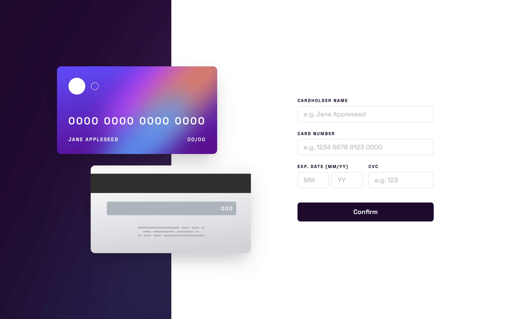
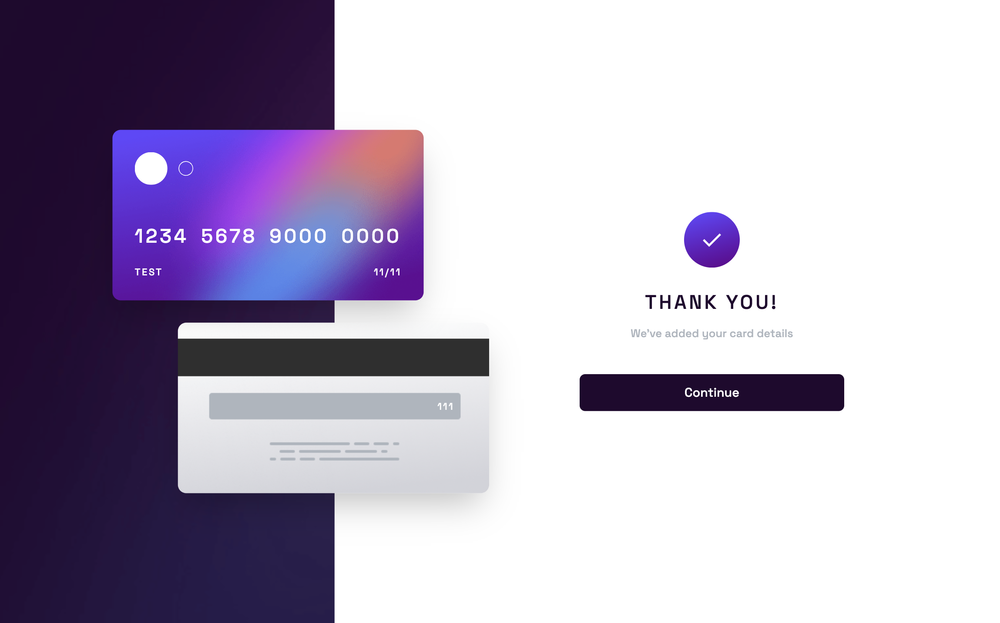

# Interactive Card Details Form

## Table of contents

- [Overview](#overview)
  - [Screenshot](#screenshot)
  - [Links](#links)
- [My process](#my-process)
  - [Built with](#built-with)
- [Author](#author)

## Overview

### Screenshot

### Links

- Solution URL: [Solution URL](https://github.com/kisu-seo/interactive_card_details_form)
- Live Site URL: [Live URL](https://kisu-seo.github.io/interactive_card_details_form/)

## My process

### Built with

- **React 19** — Component-based architecture with clean separation of concerns. The main UI is modularized into `NotificationsHeader`, `NotificationList`, and `NotificationItem` to ensure high reusability and maintainability.
- **TypeScript 6** — Leveraged for static typing and strict interface checking across components and utility modules.
- **React State Management (useReducer)** — Used the `useReducer` hook to manage user notification states robustly, partitioning actions into `'MARK_READ'` and `'MARK_ALL_READ'`.
- **Vite 8** — Utilized as the ultra-fast frontend build tool and local development server for instant Hot Module Replacement (HMR).
- **Tailwind CSS v4** — Built with the next-generation CSS engine using `@theme` directives and custom `@utility` text presets directly in `src/index.css`, eliminating legacy config files and streamlining stylesheet code.
- **clsx** — Integrated as a lightweight utility to dynamically combine and apply conditional Tailwind classes without complex string manipulation.
- **date-fns v4** — Integrated as a lightweight time utility to programmatically compute and display human-readable relative durations (e.g., "1m ago", "5h ago", "2 weeks ago") relative to real-time timestamps.
- **Semantic HTML5 & Accessibility (A11y)** — Structured with semantic tags (`<header>`, `<main>`, `<ul>`, `<li>`), accessible buttons supporting full keyboard navigation (`Tab`, `Enter`, `Space`), visually hidden screen reader labels (`Unread`), and dynamic announcement regions (`aria-live="polite"`).
- **Responsive Card Layout & Device-Specific Hover** — Mobile-first responsive grid container with a maximum desktop width of `730px`. Includes custom media queries (`@media (hover: hover)`) targeting only pointer-enabled devices to strictly prevent sticky hovers on tablets and mobile viewports.

## Author

- Website - [Kisu Seo](https://github.com/kisu-seo)
- Frontend Mentor - [@kisu-seo](https://www.frontendmentor.io/profile/kisu-seo)
